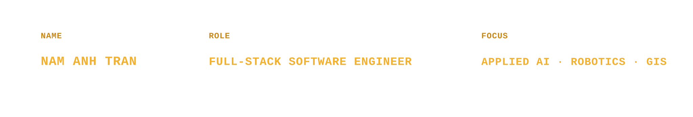
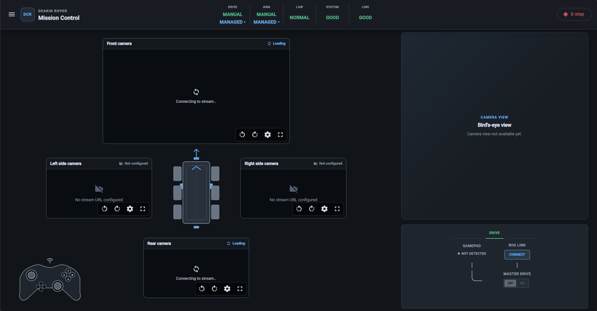
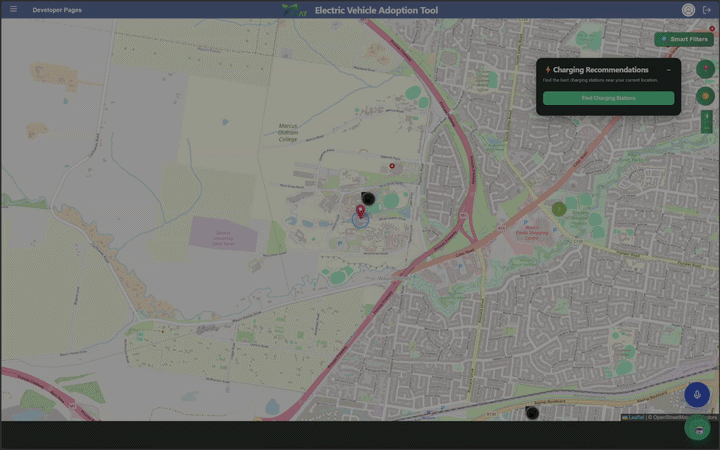
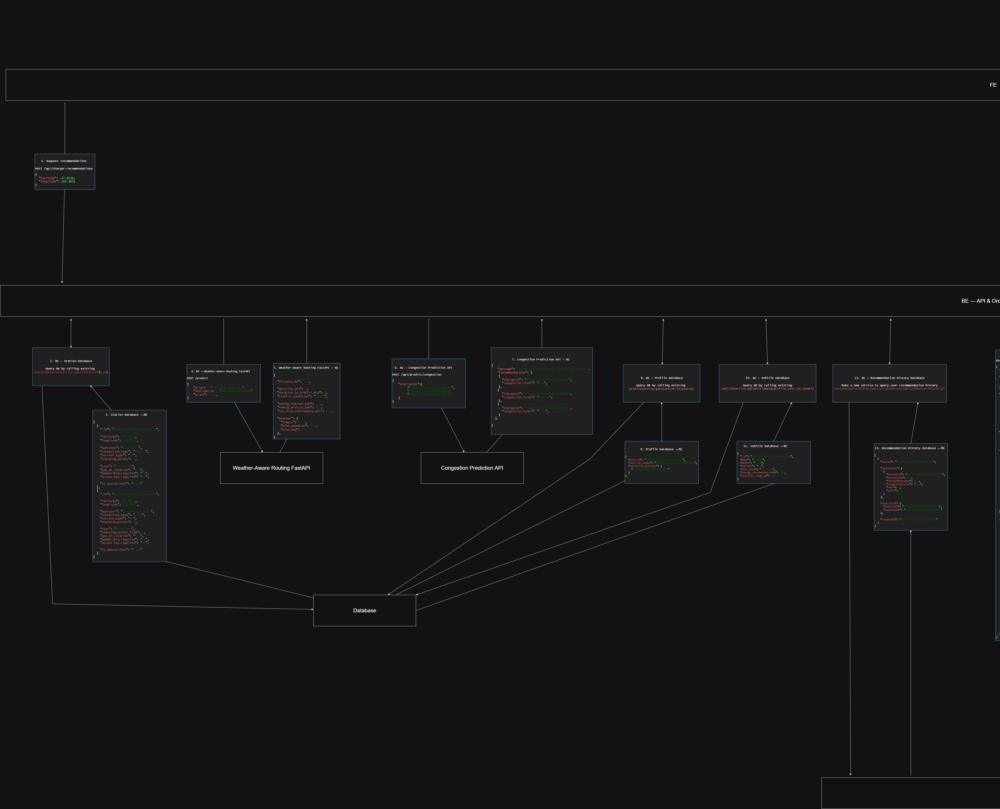
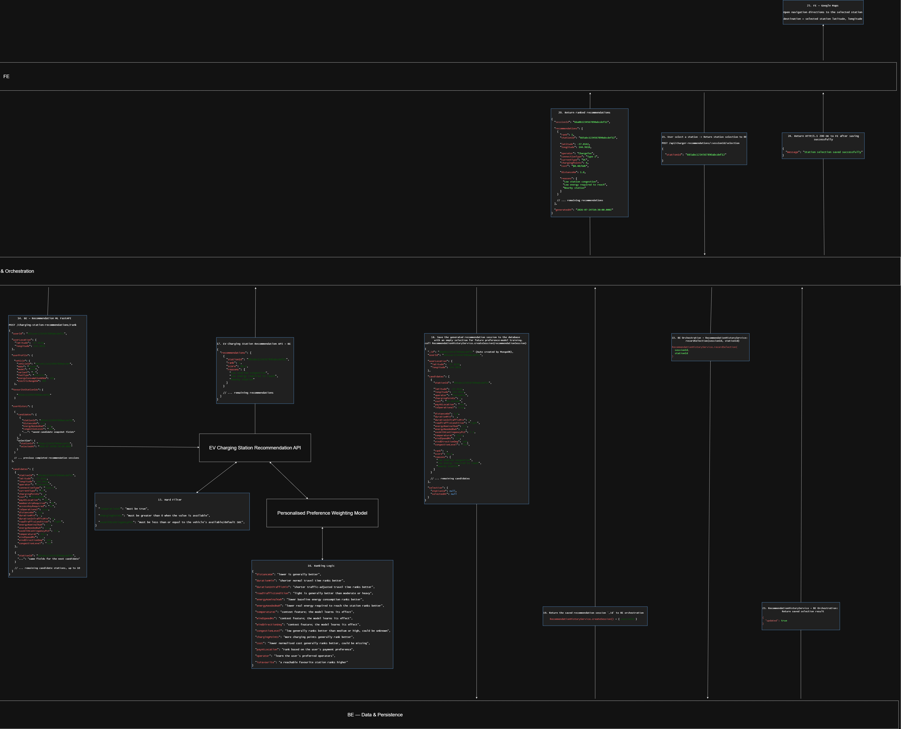
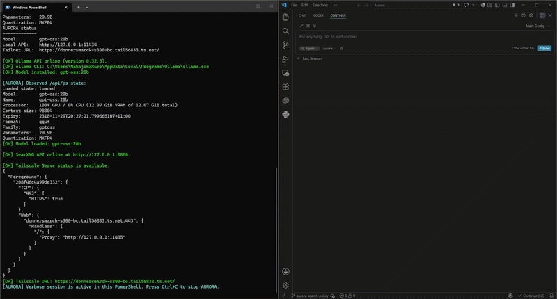
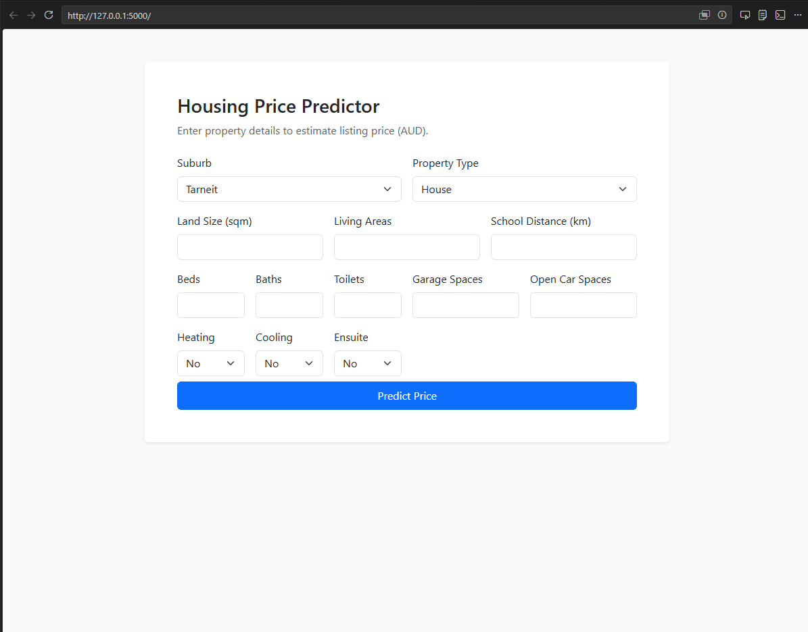
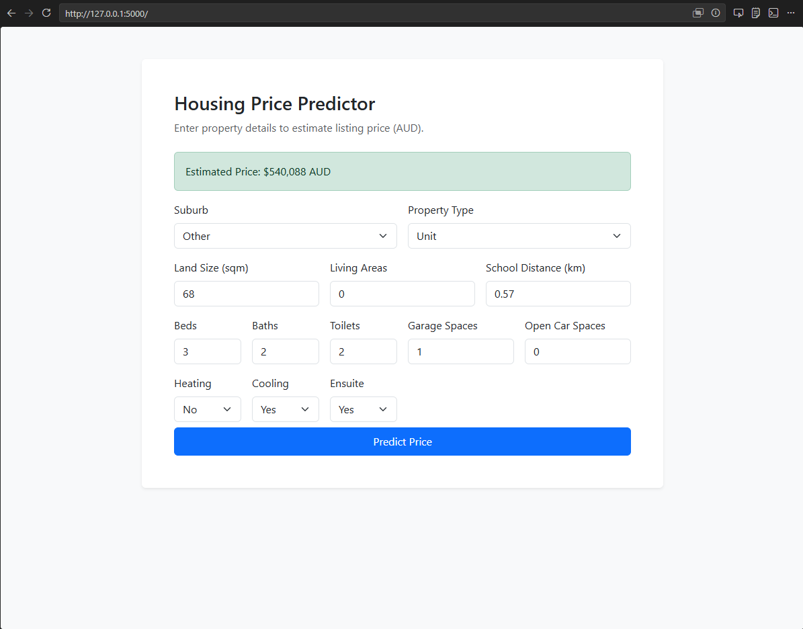

  

  Full-stack software engineer working across applied AI, robotics, GIS, and web platforms.

  <a href="#chasmata">[ CHASMATA ]</a>
  · <a href="#evat">[ EVAT ]</a>
  · <a href="#aurora">[ AURORA ]</a>
  · <a href="#housing">[ HOUSING ML ]</a>
  · <a href="#guide-my-eyes">[ GUIDE MY EYES ]</a>
  · <a href="https://www.linkedin.com/in/thomas-tran-anh">[ LINKEDIN ]</a>

---

### Chasmata — Australian Rover Challenge mission control

Chasmata is an Angular mission-control redesign for Deakin Competitive Robotics Club’s 2027 rover for the Australian Rover Challenge, where I serve as GUI lead. It is shaped by my commercial pilot background and inspired by A320 cockpit design philosophy. It uses a deliberate attention hierarchy: the FMA communicates high-level operational state, ECAM presents alerts and procedures, and System Display pages provide subsystem detail. The redesign structures the operator experience around dedicated Pilot and Arm Ops workflows, mutually exclusive Drive and Arm control, and shared Gimbal priority.

<ul>
  <li><strong>Operators:</strong> Pilot and Arm Ops workflows</li>
  <li><strong>Displays:</strong> Pilot and Arm Ops mission control, ECAM alerts and procedures, and System Display pages</li>
  <li><strong>Telemetry:</strong> rover state, subsystem health, cameras, and recovery snapshots</li>
  <li><strong>Controls:</strong> gamepad input with mutually exclusive Drive and Arm modes</li>
  <li><strong>Integration:</strong> Angular, TypeScript, ROSbridge, ROSLIB.js, and MJPEG camera streams</li>
</ul>

<strong>Pilot mission control</strong>

  

 

<strong>Arm Ops mission control</strong>

  

 

<strong>ECAM alerts and procedures</strong>

  

  <a href="https://github.com/deakin-robotics/Chasmata-2027/tree/main/gui">View GUI repository →</a>

---

### EVAT — explainable EV charging recommendations

An explainable EV charging-station recommendation feature for EVAT, where I served as technical lead. I designed the feature architecture and API contracts, coordinated ownership across a seven-member team, implemented the Python FastAPI recommendation service, and led end-to-end integration across the frontend, Node.js backend, persistence layer, and recommendation service.

<ul>
  <li><strong>Leadership:</strong> proposed the feature, secured Product Owner approval, designed the system flow, and coordinated team ownership</li>
  <li><strong>Recommendation:</strong> filters unreachable stations, ranks candidates with a trained preference model, and returns explanations</li>
  <li><strong>Personalization:</strong> combines predicted selection probability with each user’s recent selection history to nudge rankings toward their preferences</li>
  <li><strong>Fallback:</strong> retains fixed-weight scoring when the trained model is unavailable</li>
  <li><strong>Integration:</strong> resolved authorization, schema, routing-data, and recommendation-history issues across services</li>
  <li><strong>Workflow:</strong> local pull-request validation and GitHub Actions build checks for the frontend and backend</li>
</ul>

 

<strong>Charger recommendation feature demo</strong>

  

 

<strong>Existing EVAT services and recommendation inputs</strong>

  

 

<strong>New recommendation pipeline, ranking logic, and persistence</strong>

  

  <a href="https://github.com/Chameleon-company/EVAT">View repository →</a>

---

### AURORA — local AI development assistant

A self-hosted Windows PowerShell AI coding assistant that runs gpt-oss:20b locally through Ollama, uses tool-enabled web search through SearXNG, and exposes private remote access through Tailscale Serve.

<ul>
  <li><strong>Model:</strong> gpt-oss:20b via Ollama</li>
  <li><strong>Context:</strong> 40,960 tokens with Flash Attention</li>
  <li><strong>Memory:</strong> q8_0 KV-cache quantization</li>
  <li><strong>Search:</strong> local SearXNG tool integration</li>
  <li><strong>Remote access:</strong> loopback services published through Tailscale Serve</li>
</ul>

  

Fun fact: The name "AURORA" was inspired by APOLLO from <em>Alien: Isolation</em> :D

  <a href="https://github.com/NamAnhTran99/AURORA">View repository →</a>

---

### Melbourne Housing Price Predictor — deployed regression model

An end-to-end machine-learning project that estimates residential property prices from structured features and exposes the trained model through a Flask web application.

<ul>
  <li><strong>Dataset:</strong> 151 property listings across Werribee, Point Cook, and Tarneit</li>
  <li><strong>Models:</strong> Linear Regression, Random Forest, and Gradient Boosting comparison</li>
  <li><strong>Result:</strong> Random Forest achieved a held-out R² of 0.7266 with approximately $96.6k MAE</li>
  <li><strong>Deployment:</strong> exported scikit-learn pipeline served through a Flask prediction form</li>
</ul>

Educational demonstration using a small, time-specific dataset from three Melbourne suburbs.

  
  

  <a href="https://github.com/NamAnhTran99/melbourne-housing-price-predictor">View repository →</a>

---

### Guide My Eyes — bachelor thesis in audio-based vision assistance

An Android accessibility application that combines ARCore depth sensing and on-device object detection to help visually impaired users perceive nearby obstacles through sound.

<ul>
  <li><strong>Depth:</strong> ARCore Depth API for estimating obstacle distance and identifying the nearest path hazard</li>
  <li><strong>Vision:</strong> TensorFlow Lite MobileNet-SSD for on-device object detection</li>
  <li><strong>Audio:</strong> directional sound for obstacle position, pitch variation for distance, and Text-to-Speech for object labels</li>
  <li><strong>Evaluation:</strong> tested on a real Android device across corridor and street scenarios, including latency and battery measurements</li>
</ul>

Research prototype; not clinically validated or a replacement for established mobility aids.

  

  <a href="https://github.com/NamAnhTran99/GuideMyEyes">View repository →</a>
  · <a href="docs/DATN-Guide-My-Eyes.pdf">Read thesis (Vietnamese) →</a>

